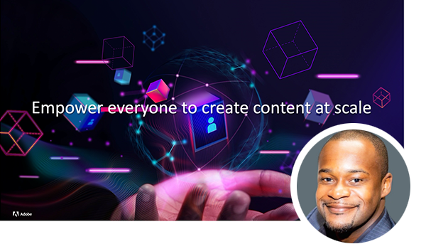

# Fórum de gerenciamento de conteúdo do Adobe {#overview}

Aprenda com especialistas do Adobe sobre o estado atual e futuro da estratégia de gerenciamento de conteúdo, os resultados, os desafios e os requisitos técnicos. Este evento virtual inclui uma palestra principal especial de Kurt Benkert, quarterback e consultor de negócios da NFL, e Haresh Kumar, Director de Estratégia e Marketing de Produtos, enquanto discutem como ter as ferramentas certas em vigor pode ajudar você a acessar ativos criativos e simplificar tarefas diárias, a fim de desbloquear o poder da velocidade do conteúdo.

Participe das sessões abaixo para saber:

* Como modernizar o gerenciamento de experiência que democratiza a criação de conteúdo, facilitando a entrega omnicanal e dimensionando a personalização para fazer com que cada experiência valha a pena.
* Como criar uma cadeia de fornecimento de conteúdo que seja dimensionada para personalização
* Como acelerar o tempo de comercialização para a criação de novos sites e reduzir a dependência de recursos técnicos
* As mais recentes inovações da [!DNL Experience Manager] oferecido como um serviço nativo em nuvem e como você se adapta às expectativas do mercado em constante mudança enquanto se mantém à frente
* Como criar sites mais rapidamente com o Adobe [!DNL Experience Manager] as a Headless CMS, usando GraphQL e fragmentos de conteúdo
* Práticas recomendadas do desenvolvedor para acelerar o tempo de entrada no mercado do Adobe Experience Manager Sites

>[!TIP]
>
>**Todas as sessões gravadas são listadas na navegação à esquerda**.

<table>
  <tr>
   <td>
      
      

         <a href="2022/welcome.md"><strong>Endereço de boas-vindas e visão geral do AEM</strong></a>         
          <em>com Elliot Sedegah, Haresh Kumar e Kurt Benkert</em>
      

      

         
         Bem-vindo à série de eventos Adobe Content Management Forum. Neste vídeo, você pode assistir ao discurso de boas-vindas, obter uma visão geral do AEM e ouvir sobre como explorar o poder da velocidade do conteúdo.
      

   </td>
   <td>
      
      

         <a href="2022/assets-for-all.md"><strong>Extensão do Adobe [!DNL Experience Manager] Headless com Adobe [!DNL App Builder]</strong></a>         
          <em>com Purnima Rachoor Roy</em>
      

      

         
          Saiba como [!DNL Assets Essentials] é o novo [!DNL Digital Asset Management] para departamentos e empresas de médio porte.
      

   </td>
   <td>
      
      

         <a href="2022/supply-chain.md"><strong>Criando uma cadeia de fornecimento de conteúdo dimensionável</strong></a>         
          <em>com Marc Angelinovich</em>
      

      

         
         Saiba como criar uma cadeia de fornecimento de conteúdo que seja dimensionada para personalização.
      

   </td>
  </tr>
</table>
