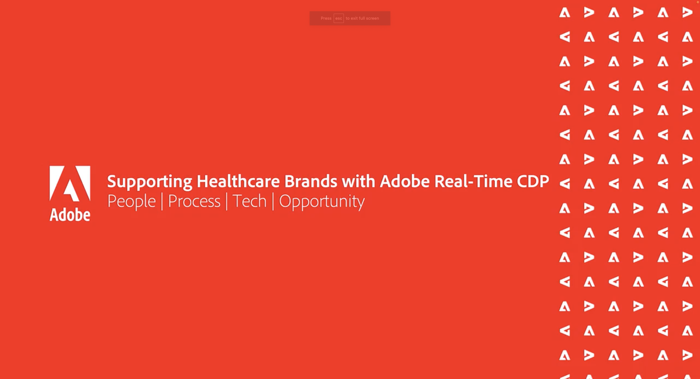

# Gerenciamento de dados do cliente - Vozes {#overview}

Bem-vindo ao Gerenciamento de dados do cliente Vozes seu destino como técnico de gerenciamento de dados e líder e especialista de práticas de marketing. Esta página é o seu balcão único para ouvir de seus colegas, inspirar-se e aprender sobre os desenvolvimentos em martech. Não é necessário se inscrever. Basta clicar e assistir.

>[!TIP]
>
>**Todas as sessões gravadas estão listadas na navegação à esquerda**.

## Blocos de construção do gerenciamento de dados do cliente

<table>
  <tr>
   <td>
      
      

         <a href="./cdm/first-mile.md"><strong>Simplificando a Primeira Milha do Gerenciamento de Dados</strong></a>
          
      

   </td>
   <td>
      
      

         <a href="./cdm/cdp-success.md"><strong>Selecionando uma Plataforma de Dados do Cliente para Êxito</strong></a>
          
      

    </td>
    <td>
      
      

         <a href="./cdm/people-and-process.md"><strong>Práticas recomendadas da CDP - Pessoas e processos</strong></a>
          
      

    </td>
   </tr>
   <tr> 
   <td>
      
      

         <a href="./cdm/evolving-your-audience-center-of-excellence.md"><strong>Desenvolvendo seu Centro de Excelência para o Público</strong></a>
          
      

    </td>
   <td>
      
      

         <a href="./cdm/building-better-experiences-with-customer-profiles.md"><strong>Criando melhores experiências com perfis de clientes</strong></a>
      

      

         
    </td>
   <td>
      
      

         <a href="./cdm/how-marketing-teams-are-improving-data-management-strategies.md"><strong>Como as equipes de marketing estão aprimorando as estratégias de gerenciamento de dados</strong></a>
      

      

      

    </td>
  </tr>
</table>

## Governança e privacidade de dados de públicos-alvo e perfis

<table>
  <tr>
   <td>
      
      

         <a href="./governance/healthcare-shield.md"><strong>Adobe Real-time Customer Data Platform e Healthcare Shield</strong></a>
          
      

      

         
   </td> 
   <td>
      
      

         <a href="https://experienceleague.adobe.com/docs/platform-learn/tutorials/privacy/ten-considerations-for-responsible-customer-data-management.html"><strong>10 considerações para o gerenciamento responsável de dados do cliente</strong></a>
          
      

      

         
    </td>
    <td>
      
      

         <a href="https://experienceleague.adobe.com/docs/platform-learn/tutorials/privacy/elevating-the-marketers-role-as-a-data-steward.html"><strong>Elevação da função de profissional de marketing como administrador de dados</strong></a>
          
      

      

         
       

    </td>
  </tr>
</table>

## Discussões do setor

<table>
  <tr>
     <td>
      
      

         <a href="./industry/build-superb-experiences-with-your-first-party-data.md"><strong>Crie experiências excelentes com seus dados primários</strong></a>
      

      

      

    </td>
     <td>
      
      

         <a href="./industry/data-collaboration-in-the-first-party-data-context.md"><strong>Data Collaboration no Contexto de Dados Próprios</strong></a>
      

      

      

    </td>
     <td>
      
      

         <a href="./industry/the-future-of-data-management-and-the-changing-environment.md"><strong>O futuro do gerenciamento de dados e do ambiente em mudança</strong></a>
      

      

      

    </td>
   <td>
      
      

         <a href="./industry/brands-vs-consumers.md"><strong>Os dois lados da moeda - marcas e consumidores</strong></a>
          
      

    </td>
  </tr>
</table>
