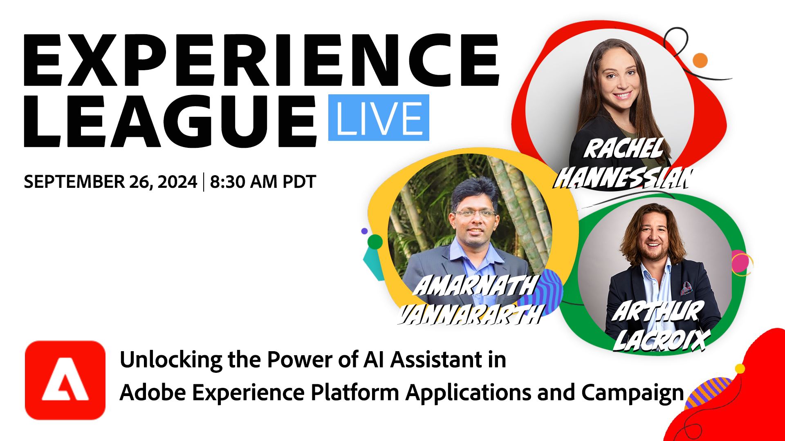

# AI Bash - Desbloquear o poder do assistente de IA em aplicativos Adobe Experience Platform e no Campaign

Explore como o Assistente de IA transforma as interações do cliente e melhora a produtividade nos aplicativos da Adobe Experience Cloud e no Adobe Campaign. 

**[Definir um lembrete para o programa no YouTube](https://www.youtube.com/watch?v=J48CNmcV7wc){target="_blank"}**

**Exibir detalhes**:

As ferramentas orientadas por IA estão transformando a maneira como envolvemos os clientes e simplificamos os fluxos de trabalho. Junte-se ao nosso programa de Experience League ao vivo com tema de IA para acompanhar o ritmo da inovação e saber como os recursos do Adobe acelerarão sua produtividade. 

