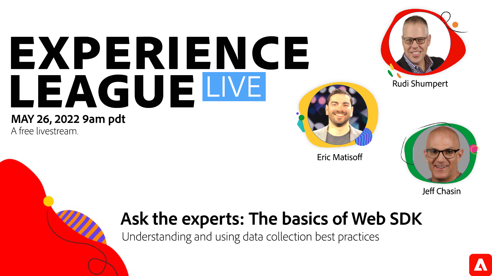

# Experience League LIVE 

Experience League LIVE é um programa de streaming ao vivo produzido pela equipe da Experience League.  É uma chance de se conectar com especialistas em produtos da Adobe e aprender dicas, truques e estratégias úteis que podem ser usados com os aplicativos da Adobe Experience Cloud.

## Próximos eventos Experience League LIVE

<table>
<tr>
  <td style="vertical-align: top;">
    

      <a href="episodes/exl-live-episode-5-24-23.md">
        <strong>Maximize o potencial do seu aplicativo móvel com o Adobe Journey Optimizer</strong>
      </a>
       <em>com Sandra Hausmann, Chetan Prasad e Peter Fransen</em>
       <em>24 de maio de 2023</em>
    

  </td>
</tr>
</table>

## Escolhas da equipe

<table style="max-width: 1214px;">

<tr>
  <td style="vertical-align: top;">
    

      <a href="/help/experience-league-live/episodes/exl-live-episode-04-21-22.md">
        <strong>AEM de Headful a Headless</strong>
      </a>
       <em>com Danny Gordon, Amol Anand, Sachin Mali e Sean Steimer</em>
       <em>21 de abril de 2022</em>
    

  </td>

<td style="vertical-align: top;">
    
    

      <a href="episodes/exl-live-episode-08.md"><strong>Customer Journey Analytics - O furo interno</strong></a>
       <em>com Trevor Paulsen, Rohit Gossain, Alex Strawn</em>
       <em>25 de janeiro de 2021</em>
    

  </td>

<td style="vertical-align: top;">
    
    

      <a href="episodes/exl-live-episode-05-26-22.md">
        <strong>Pergunte aos especialistas: noções básicas do SDK da Web</strong>
      </a>
       <em>com Rudi Shumpert, Jeff Chasin e Eric Matisoff</em>
       <em>26 de maio de 2022</em>
    

  </td>
  </tr>

</table>

>[!TIP]
>
>Para obter métodos adicionais de aprendizado, consulte nossos [cursos](https://experienceleague.adobe.com/?lang=pt-BR#dashboard/learning) gratuitos, bem como [tutoriais](https://experienceleague.adobe.com/docs/home-tutorials.html?lang=pt-BR) individuais.
