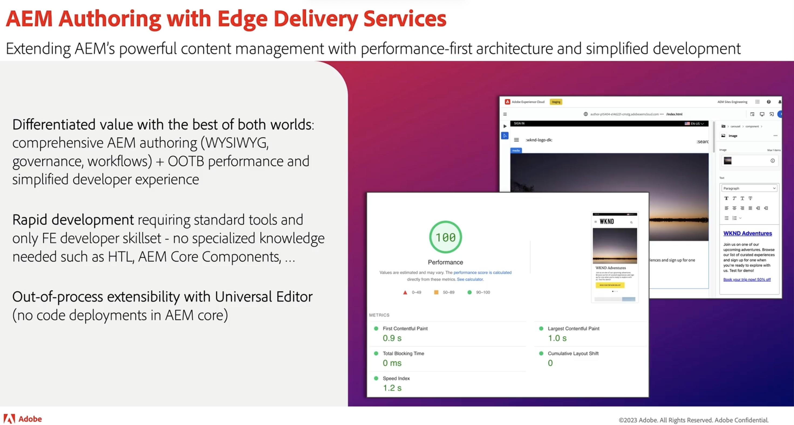
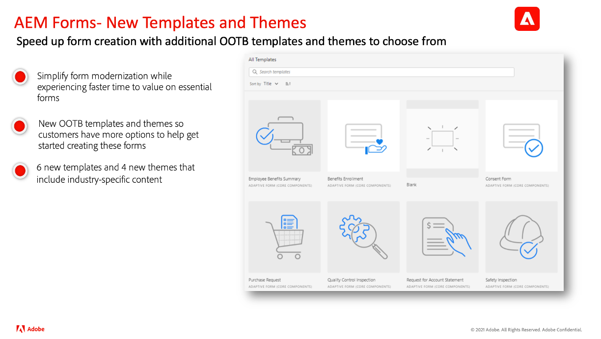

# Atualizações da versão do Adobe Experience Manager as a Cloud Service

Obtenha uma visão geral rápida dos recursos mais recentes no Adobe Experience Manager as a Cloud Service. São vídeos curtos, de aproximadamente 10 minutos, disponibilizados pela equipe de produtos AEM que compartilham os destaques da versão mais recente.

## Última atualização

<table style="max-width: 50%;">
  <tr>
    <td>
      
      

        <a href="2024/2024-4-0.md">
          <strong>Versão | 2024.4.0</strong>
        </a>
      

      
<em>Data de lançamento: maio de 2024 </em>

      

        <a href="https://experienceleague.adobe.com/docs/experience-manager-cloud-service/content/release-notes/release-notes/release-notes-current.html?lang=pt-BR">Notas de versão</a>
      

    </td>
  </tr>  
</table>

## Atualizações anteriores

<table style="max-width: 50%;">
  <tr>
    <td>
      
      

        <a href="2024/2024-3-0.md">
          <strong>Versão | 2024.3.0</strong>
        </a>
      

      
<em>Data de lançamento: abril de 2024 </em>

      

        <a href="https://experienceleague.adobe.com/docs/experience-manager-cloud-service/content/release-notes/release-notes/release-notes-current.html?lang=pt-BR">Notas de versão</a>
      

    </td>
    <td>
      
      

        <a href="2024/2024-1-0.md">
          <strong>Versão | 2024.1.0</strong>
           
        </a>
          <em>Data de lançamento: janeiro de 2024 </em>
      

      

        <a href="https://experienceleague.adobe.com/docs/experience-manager-cloud-service/content/release-notes/release-notes/release-notes-current.html?lang=pt-BR">Notas de versão</a>
      

    </td>
    <td>
      
      

        <a href="2023/2023-11-0.md">
          <strong>Versão | 2023.11.0</strong>
           
        </a>
          <em>Data de lançamento: novembro de 2023 </em>
      

      

        <a href="https://experienceleague.adobe.com/docs/experience-manager-cloud-service/content/release-notes/release-notes/release-notes-current.html?lang=pt-BR">Notas de versão</a>
      

    </td>
  </tr>
  <tr>
    <td>
      
      

        <a href="2023/2023-10-0.md">
          <strong>Versão | 2023.10.0</strong>
           
        </a>
          <em>Data de lançamento: outubro de 2023 </em>
      

      

        <a href="https://experienceleague.adobe.com/docs/experience-manager-cloud-service/content/release-notes/release-notes/release-notes-current.html?lang=pt-BR">Notas de versão</a>
      

    </td>
    <td>
      
      

        <a href="2023/2023-9-0.md">
          <strong>Versão | 2023.9.0</strong>
           
        </a>
          <em>Data de lançamento: setembro de 2023 </em>
      

      

        <a href="https://experienceleague.adobe.com/docs/experience-manager-cloud-service/content/release-notes/release-notes/release-notes-current.html?lang=pt-BR">Notas de versão</a>
      

    </td> 
    <td>
      
      

        <a href="2023/2023-8-0.md">
          <strong>Versão | 2023.8.0</strong>
           
        </a>
          <em>Data de lançamento: agosto de 2023 </em>
      

      

        <a href="https://experienceleague.adobe.com/docs/experience-manager-cloud-service/content/release-notes/release-notes/release-notes-current.html?lang=pt-BR">Notas de versão</a>
      

    </td>
  </tr>
  <tr>    
    <td>
      
      

        <a href="2023/2023-7-0.md">
          <strong>Versão | 2023.7.0</strong>
           
        </a>
          <em>Data de lançamento: julho de 2023 </em>
      

      

        <a href="https://experienceleague.adobe.com/docs/experience-manager-cloud-service/content/release-notes/release-notes/release-notes-current.html?lang=pt-BR">Notas de versão</a>
      

    </td>
    <td>
      
      

        <a href="2023/2023-6-0.md">
          <strong>Versão | 2023.6.0</strong>
           
        </a>
          <em>Data de lançamento: junho de 2023 </em>
      

      

        <a href="https://experienceleague.adobe.com/docs/experience-manager-cloud-service/content/release-notes/release-notes/release-notes-current.html?lang=pt-BR">Notas de versão</a>
      

    </td>    
    <td>
      
      

        <a href="2023/2023-4-0.md">
          <strong>Versão | 2023.4.0</strong>
           
        </a>
          <em>Data de lançamento: abril de 2023 </em>
      

      

        <a href="https://experienceleague.adobe.com/docs/experience-manager-cloud-service/content/release-notes/release-notes/release-notes-current.html?lang=pt-BR">Notas de versão</a>
      

    </td>
  </tr>
</table>
