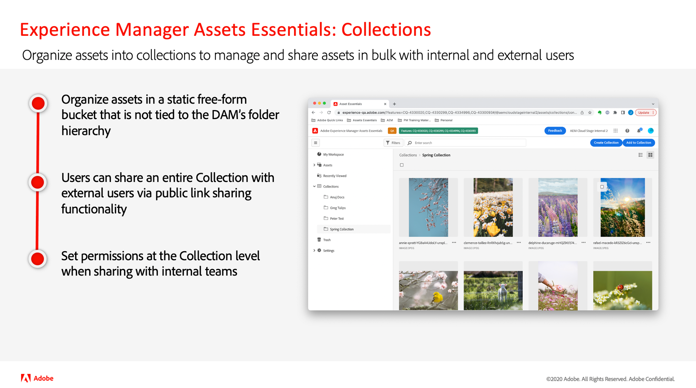

# Atualizações da versão do Adobe Experience Manager as a Cloud Service

Obtenha uma visão geral rápida dos recursos mais recentes no Adobe Experience Manager as a Cloud Service. São vídeos curtos, de aproximadamente 10 minutos, disponibilizados pela equipe de produtos AEM que compartilham os destaques da versão mais recente.
<!--
## Latest Update

<table style="max-width: 50%;">
  <tr>
    <td>
      
      

        <a href="2023/2023-7-0.md">
          <strong>Release | 2023.7.0</strong>
           
        </a>
          <em>Release date July 2023 </em>
      

      

        <a href="https://experienceleague.adobe.com/docs/experience-manager-cloud-service/content/release-notes/release-notes/release-notes-current.html">Release notes</a>
      

    </td>
  </tr>  
</table> 

## Past Updates

<table style="max-width: 50%;">
  <tr>
    <td>
      
      

        <a href="2023/2023-6-0.md">
          <strong>Release | 2023.6.0</strong>
           
        </a>
          <em>Release date June 2023 </em>
      

      

        <a href="https://experienceleague.adobe.com/docs/experience-manager-cloud-service/content/release-notes/release-notes/release-notes-current.html">Release notes</a>
      

    </td>
    <td>
      
      

        <a href="2023/2023-4-0.md">
          <strong>Release | 2023.4.0</strong>
           
        </a>
          <em>Release date June 2023 </em>
      

      

        <a href="https://experienceleague.adobe.com/docs/experience-manager-cloud-service/content/release-notes/release-notes/release-notes-current.html">Release notes</a>
      

    </td>
    <td>
      
      

        <a href="2023/2023-2-0.md">
          <strong>Release | 2023.2.0</strong>
           
        </a>
          <em>Release date Mar 2023 </em>
      

      

        <a href="https://experienceleague.adobe.com/docs/experience-manager-cloud-service/content/release-notes/release-notes/release-notes-current.html">Release notes</a>
      

    </td>
    <tr>
    <td>
      
      

        <a href="2023/2023-1-0.md">
          <strong>Release | 2023.1.0</strong>
           
        </a>
          <em>Release date  Feb 2023 </em>
      

      

        <a href="https://experienceleague.adobe.com/docs/experience-manager-cloud-service/content/release-notes/release-notes/release-notes-current.html">Release notes</a>
      

    </td>
    <td>
      
      

        <a href="2022/2022-10-0.md">
          <strong>Release | 2022.10.0</strong>
           
        </a>
          <em>Release date  Oct 13, 2022 </em>
      

      

        <a href="https://experienceleague.adobe.com/docs/experience-manager-cloud-service/content/release-notes/release-notes/release-notes-current.html">Release notes</a>
      

    </td>
    <td>
      
      

        <a href="2022/2022-8-0.md">
          <strong>Release | 2022.8.0</strong>
           
        </a>
          <em>Release date  Sept 1, 2022 </em>
      

      

        <a href="https://experienceleague.adobe.com/docs/experience-manager-cloud-service/content/release-notes/release-notes/release-notes-current.html">Release notes</a>
      

    </td>
    </tr>
    <td>
      
      

        <a href="2022/2022-7-0.md">
          <strong>Release | 2022.7.0</strong>
           
        </a>
          <em>Release date  Aug 8, 2022 </em>
      

      

        <a href="https://experienceleague.adobe.com/docs/experience-manager-cloud-service/content/release-notes/release-notes/release-notes-current.html">Release notes</a>
      

    </td>
    <td>
      
      

        <a href="2022/2022-6-0.md">
          <strong>Release | 2022.6.0</strong>
           
        </a>
          <em>Release date  June 30, 2022 </em>
      

      

        <a href="https://experienceleague.adobe.com/docs/experience-manager-cloud-service/content/release-notes/release-notes/release-notes-current.html">Release notes</a>
      

    </td>
    <td>
      
      

        <a href="2022/2022-5-0.md">
          <strong>Release | 2022.5.0</strong>
           
        </a>
          <em>Release date  June 9, 2022 </em>
      

      

        <a href="https://experienceleague.adobe.com/docs/experience-manager-cloud-service/content/release-notes/release-notes/release-notes-current.html">Release notes</a>
      

    </td>
  </tr>
</table>

 -->

## Última atualização

<table style="max-width: 50%;">
  <tr>
    <td>
      
      

        <a href="2023/2023-6-0.md">
          <strong>Versão | 2023.6.0</strong>
           
        </a>
          <em>Data de lançamento: junho de 2023 </em>
      

      

        <a href="https://experienceleague.adobe.com/docs/experience-manager-cloud-service/content/release-notes/release-notes/release-notes-current.html?lang=pt-BR">Notas de versão</a>
      

    </td>
  </tr>  
</table>

## Atualizações anteriores

<table style="max-width: 50%;">
  <tr>
    <td>
      
      

        <a href="2023/2023-4-0.md">
          <strong>Versão | 2023.4.0</strong>
           
        </a>
          <em>Data de lançamento: junho de 2023 </em>
      

      

        <a href="https://experienceleague.adobe.com/docs/experience-manager-cloud-service/content/release-notes/release-notes/release-notes-current.html?lang=pt-BR">Notas de versão</a>
      

    </td>
    <td>
      
      

        <a href="2023/2023-2-0.md">
          <strong>Versão | 2023.2.0</strong>
           
          </a>
          <em>Data de lançamento: março de 2023 </em>
      

      

        <a href="https://experienceleague.adobe.com/docs/experience-manager-cloud-service/content/release-notes/release-notes/release-notes-current.html?lang=pt-BR">Notas de versão</a>
      

    </td>
    <td>
      
      

        <a href="2023/2023-1-0.md">
          <strong>Versão | 2023.1.0</strong>
           
        </a>
          <em>Data de lançamento: fevereiro de 2023 </em>
      

      

        <a href="https://experienceleague.adobe.com/docs/experience-manager-cloud-service/content/release-notes/release-notes/release-notes-current.html?lang=pt-BR">Notas de versão</a>
      

    </td>
  </tr>  
  <tr> 
    <td>
      
      

        <a href="2022/2022-10-0.md">
          <strong>Versão | 2022.10.0</strong>
           
        </a>
          <em>Data de lançamento: 13 de outubro de 2022</em>
      

      

        <a href="https://experienceleague.adobe.com/docs/experience-manager-cloud-service/content/release-notes/release-notes/release-notes-current.html?lang=pt-BR">Notas de versão</a>
      

    </td>
    <td>
      
      

        <a href="2022/2022-8-0.md">
          <strong>Versão | 2022.8.0</strong>
           
        </a>
          <em>Data de lançamento: 1 de setembro de 2022 </em>
      

      

        <a href="https://experienceleague.adobe.com/docs/experience-manager-cloud-service/content/release-notes/release-notes/release-notes-current.html?lang=pt-BR">Notas de versão</a>
      

    </td>
    <td>
      
      

        <a href="2022/2022-7-0.md">
          <strong>Release | 2022.7.0</strong>
           
        </a>
          <em>Data de lançamento: Aug 8, 2022 </em>
      

      

        <a href="https://experienceleague.adobe.com/docs/experience-manager-cloud-service/content/release-notes/release-notes/release-notes-current.html?lang=pt-BR">Notas de versão</a>
      

    </td>
</tr>
<tr>
    <td>
      
      

        <a href="2022/2022-6-0.md">
          <strong>Versão | 2022.6.0</strong>
         
      </a>
        <em>Data de lançamento: 30 de junho de 2022 </em>
      

      

        <a href="https://experienceleague.adobe.com/docs/experience-manager-cloud-service/content/release-notes/release-notes/release-notes-current.html?lang=pt-BR">Notas de versão</a>
      

    </td>
    <td>
      
      

        <a href="2022/2022-5-0.md">
          <strong>Versão | 2022.5.0</strong>
         
      </a>
        <em>Data de lançamento: 9 de junho de 2022 </em>
      

      

        <a href="https://experienceleague.adobe.com/docs/experience-manager-cloud-service/content/release-notes/release-notes/release-notes-current.html?lang=pt-BR">Notas de versão</a>
      

    </td>
    <td>
      
      

        <a href="2022/2022-4-0.md">
          <strong>Release | 2022.4.0</strong>
         
      </a>
        <em>Released May 5, 2022 </em>
      

      

        <a href="https://experienceleague.adobe.com/docs/experience-manager-cloud-service/content/release-notes/release-notes/release-notes-current.html?lang=pt-BR">Notas de versão</a>
      

    </td>
  </tr>
</table>

