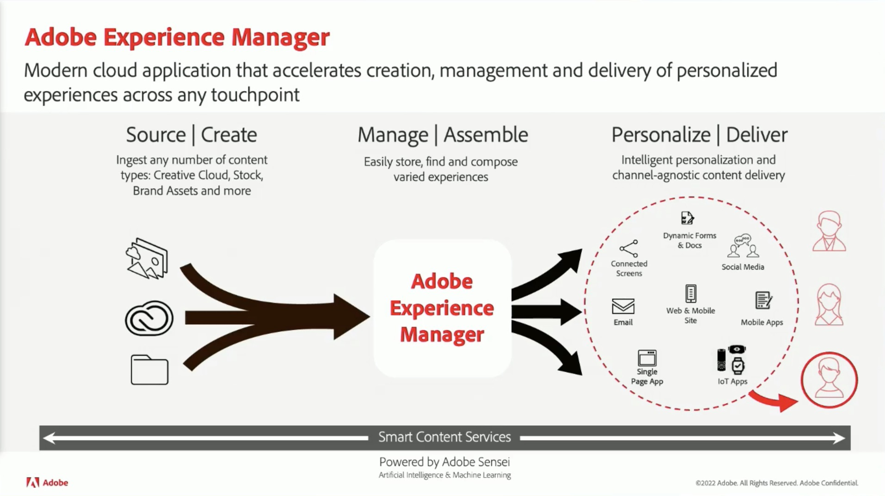

# Conteúdo e Comércio

Crie e gerencie diversos sites, aplicativos móveis e formulários envolventes. Além disso, aprenda a criar experiências de comércio de vários canais em uma única plataforma com nossa solução comercial flexível alimentada por IA.

## Novidades

<table>
<tr>
  <td>
    
     

      <a href="https://experienceleague.adobe.com/docs/skill-builder-events/skill-builder/content-and-commerce/2022/headless.html">
        <strong>Fornecer experiências headless com o Adobe Experience Manager</strong>
      </a>
    

    

    <em>Saiba mais sobre o gerenciamento de experiência headless usando as melhorias mais recentes do Fragmento de conteúdo do Experience Manager e a nova API GraphQL para a entrega de conteúdo headless.</em>
    

  </td>
  <td>
    
     

      <a href="https://experienceleague.adobe.com/docs/skill-builder-events/skill-builder/content-and-commerce/2022/metadata.html">
        <strong>Faça com que os metadados funcionem para sua empresa no Adobe Experience Manager Assets</strong>
      </a>
    

    

    <em>Saiba como aproveitar ao máximo seus metadados no AEM Assets ao reduzir a carga de trabalho para marcar ativos e tornar seus ativos mais pesquisáveis.</em>
    

  </td>  
  <td>
    
     

      <a href="https://experienceleague.adobe.com/docs/skill-builder-events/skill-builder/content-and-commerce/2022/workflow.html">
        <strong>Aproveite ao máximo o Gerenciamento de fluxos de trabalho corporativos</strong>
      </a>
    

    

    <em>Nesta sessão, você aprenderá os benefícios de usar fluxos de trabalho para o gerenciamento de ativos e como criá-los rapidamente.</em>
    

  </td>
</tr>
</table>

>[!TIP]
>
>**Todas as sessões gravadas são listadas na navegação à esquerda**.
