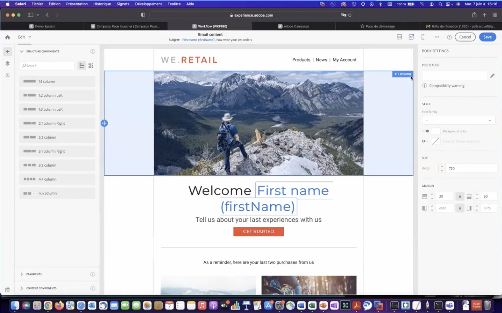

# Jornadas do cliente

Desenvolva perfis de clientes em tempo real obtendo dados de todas as fontes para criar jornadas personalizadas entre canais.

## Novidades

<table>
<tr>
  <td>
    
     

      <a href="https://experienceleague.adobe.com/docs/skill-builder-events/skill-builder/customer-journeys/2022/b2b-campaigns.html">
        <strong>Melhor juntos - Adobe Marketo Engage e Real-Time CDP</strong>
      </a>
    

    

    <em>Saiba como orquestrar campanhas B2B com Marketo Engage e RT-CDP (edição B2B) e quais são os principais casos de uso e vantagens.</em>
    

  </td>
  <td>
    
     

      <a href="https://experienceleague.adobe.com/docs/skill-builder-events/skill-builder/customer-journeys/2022/data-models.html">
        <strong>Desenvolver e personalizar modelos de dados no Adobe Campaign Classic</strong>
      </a>
    

    

    <em>Participe desta sessão com nosso treinador do Campaign para saber como desenvolver um esquema de dados dentro de um modelo de dados no Campaign Classic.</em>
    

  </td>  
  <td>
    
     

      <a href="https://experienceleague.adobe.com/docs/skill-builder-events/skill-builder/customer-journeys/2022/tips-and-tricks.html">
        <strong>Principais dicas e truques para o Adobe Campaign Standard</strong>
      </a>
    

    

    <em>Conecte-se à sua instância do Adobe Campaign Standard e descubra as práticas recomendadas relacionadas ao direcionamento, à personalização e fadiga de marketing para ter um melhor uso do ACS.</em>
    

  </td>
</tr>
</table>

>[!TIP]
>
>**Todas as sessões gravadas são listadas na navegação à esquerda**.
