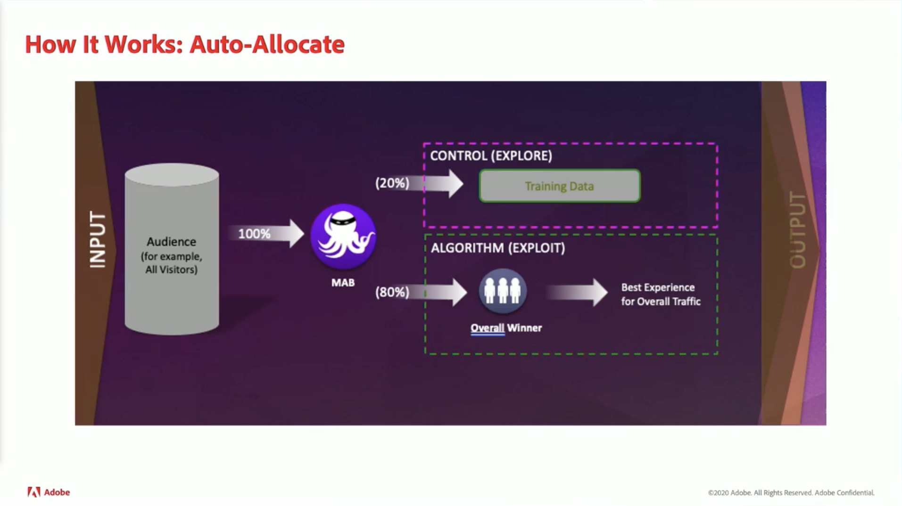

# Dados e insights

Impulsione a personalização em tempo real em qualquer canal usando insights de dados online e offline em toda a organização.

## Novidades

<table>
<tr>
  <td>
    
     

      <a href="https://experienceleague.adobe.com/docs/events//data-and-insights/2022/personalize.html">
        <strong>Personalizar e automatizar com o Adobe Target</strong>
      </a>
    

    

    <em>Participe desta sessão para saber mais sobre os conceitos principais de automatização e otimização de recursos do Adobe Target usando Direcionamento automático e Personalizações automáticas.</em>
    

  </td>
  <td>
    
     

      <a href="https://experienceleague.adobe.com/docs/events//data-and-insights/2022/innovations.html">
        <strong>Inovações e tendências em 2022</strong>
      </a>
    

    

    <em>Nesta sessão de palestras, você aprenderá sobre as principais tendências em D&amp;I. Junte-se a nós para explorar como você pode fazer uso relevante de seus dados, maximizando totalmente seus investimentos em Experience Cloud e espiar em novas inovações.</em>
    

  </td>  
  <td>
    
     

      <a href="https://experienceleague.adobe.com/docs/events//data-and-insights/2022/mobile-and-apps.html">
        <strong>Aplicativos do Analytics e do Target para dispositivos móveis e aplicativos</strong>
      </a>
    

    

    <em>Nesta sessão, você aprenderá sobre as práticas recomendadas de uso dos painéis do Analytics em dispositivos móveis, bem como sobre como personalizar aplicativos por meio do Target.</em>
    

  </td>
</tr>
</table>

>[!TIP]
>
>**Todas as sessões gravadas são listadas na navegação à esquerda**.
